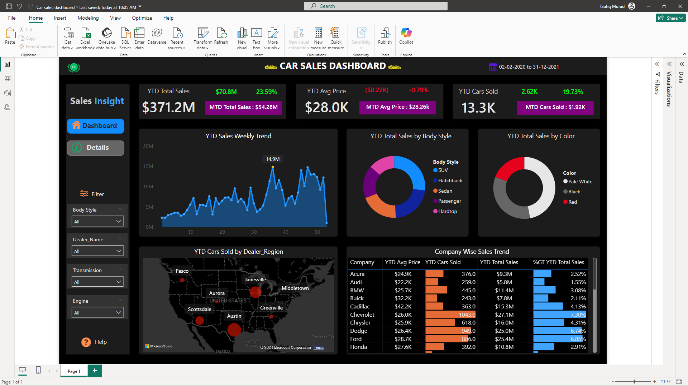

# Dynamic Car Sales Tracking and Analysis Dashboard in Power BI

## Overview

This Power BI dashboard provides a dynamic view of car sales data, enabling users to track and analyze sales performance year-to-date (YTD). It includes key metrics such as total sales, average price, total cars sold, and sales breakdowns by body style, color, and dealer region.

## Features

- **Sales Insights**: 
  - **YTD Total Sales**: Displays the year-to-date total sales and month-to-date (MTD) sales.
  - **YTD Avg Price**: Shows the average price of cars sold, including MTD comparisons.
  - **YTD Cars Sold**: Provides the total number of cars sold YTD, with MTD values.
- **Sales Trends**:
  - **Weekly Sales Trend**: Line chart tracking weekly sales trends throughout the year.
  - **Body Style & Color Breakdown**: Pie charts showing sales distribution by car body style and color.
  - **Sales by Dealer Region**: A map visual that highlights the number of cars sold across different dealer locations in the United States.
- **Company-Wise Sales Analysis**:
  - Displays sales figures, average price, and total units sold by each car company, along with the percentage contribution to total YTD sales.
- **Interactive Filters**: Filters for body style, dealer name, transmission, and engine type allow for detailed analysis and customized views.

## Installation

To view and interact with this dashboard, you'll need:
- **Microsoft Power BI**: Download [here](https://powerbi.microsoft.com/)
- **Car Sales Dataset**: (Add link to dataset if available)

## Usage

1. Open the Power BI file with Power BI Desktop.
2. Use the interactive filters to explore sales trends by different attributes.
3. Analyze the visualizations to understand sales performance by company, region, body style, and color.

## Insights

- **Sales Hotspots**: The map visualization helps identify regions with the highest car sales.
- **Popular Car Types**: The SUV body style and black color appear to be popular choices among customers.
- **Company Performance**: The dashboard shows that Chevrolet has the highest number of cars sold, with detailed figures for other companies as well.

## License

This project is licensed under the MIT License. See the [LICENSE](LICENSE) file for details.

## Acknowledgments

- Data sourced from (Specify data source if available).
- Dashboard created using Microsoft Power BI.

## Contact

For questions or feedback, feel free to contact me at (Your Email).

---

Feel free to adjust the content to fit your specific project details.
